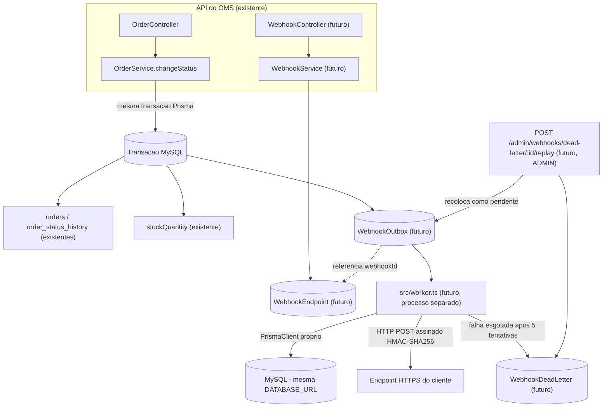

# FDD: Sistema de Webhooks de Notificação de Pedidos

## Metadados

| Campo | Valor |
| --- | --- |
| Autor | William Ferreira Leandro |
| Status | Proposto para implementação |
| Data | 03 de agosto de 2026 |
| Feature | Sistema de Webhooks de Notificação de Pedidos |
| RFC relacionado | [`./RFC.md`](./RFC.md) |
| ADRs relacionados | [`ADR-001`](./adrs/ADR-001-outbox-transacional-no-mysql.md) · [`ADR-002`](./adrs/ADR-002-worker-separado-com-polling.md) · [`ADR-003`](./adrs/ADR-003-retry-com-backoff-e-dlq.md) · [`ADR-004`](./adrs/ADR-004-autenticacao-hmac-sha256.md) · [`ADR-005`](./adrs/ADR-005-entrega-at-least-once-com-event-id.md) · [`ADR-006`](./adrs/ADR-006-reuso-dos-padroes-existentes.md) |

Convenção usada neste documento: trechos citados como `[hh:mm] Nome` referem-se a `TRANSCRICAO.md`; trechos marcados como `(código)` referem-se a arquivos reais do repositório. Onde um detalhe é necessário para implementação mas não foi fechado na reunião, o trecho é sinalizado com:

> Decisão de design proposta no FDD, sujeita à revisão.

## Resumo técnico

A feature adiciona notificação **outbound** de mudança de status de pedidos para clientes B2B, via um padrão **Outbox transacional** em uma tabela MySQL já compartilhada pelo OMS. O evento é inserido na mesma transação Prisma de `OrderService.changeStatus`. Um **worker Node.js separado** (`src/worker.ts`, processo próprio, `PrismaClient` dedicado) faz **polling a cada 2 segundos** e entrega os eventos via **HTTP POST assinado com HMAC-SHA256**. A garantia de entrega é **at-least-once**, com deduplicação do lado do cliente via `X-Event-Id`. Falhas passam por **retry com backoff exponencial** (5 tentativas: 1m/5m/30m/2h/12h) e, ao esgotar, migram para uma **Dead Letter Queue (DLQ)** reprocessável manualmente por um endpoint administrativo restrito a `ADMIN`. Toda a implementação segue os padrões já existentes no OMS: estrutura de módulo (`controller/service/repository/routes/schemas`), `AppError`, logger Pino, middleware de erro central e autenticação JWT/RBAC.

## Contexto e motivação técnica

*(Fato — transcrição)* Três clientes B2B (Atlas Comercial, MaxDistribuição, Nova Cargo) pediram notificação em tempo real de mudança de status de pedidos; hoje fazem polling repetido em `GET /orders`, considerado "lento e caro" (`[09:00] Marcos`). Latência abaixo de 10s é aceitável para o cliente (`[09:02] Marcos`). Há risco de churn do cliente Atlas se a entrega não ocorrer até o fim do trimestre, prazo depois refinado para fim de novembro (`[09:00]`, `[09:45] Marcos`).

*(Observação — código)* `OrderService.changeStatus` (`src/modules/orders/order.service.ts:126-179`) já executa, dentro de `this.prisma.$transaction(async (tx) => {...})`, a validação de transição, o débito/reposição de estoque, a atualização do pedido (`tx.order.update`) e a criação do histórico (`tx.orderStatusHistory.create`). Não existe hoje nenhuma chamada HTTP de saída, fila, ou mecanismo de evento nesse fluxo — confirmado por leitura direta do arquivo e por busca de `webhook*`/`worker*` no repositório, que não retornou nenhum resultado (`reports/context-analysis.md`, seção R).

Este FDD detalha como inserir a notificação de forma atômica nesse fluxo já existente, sem alterar seu comportamento atual para os fluxos que não envolvem webhooks.

## Objetivos técnicos

- Inserir o evento de webhook na mesma transação Prisma de `changeStatus`, com rollback conjunto em caso de falha (`[09:40]-[09:41] Bruno, Diego`; ADR-001).
- Processar a entrega em um processo separado da API (`src/worker.ts`), evitando qualquer chamada HTTP síncrona dentro da transação de pedidos (`[09:04] Bruno`, `[09:11] Diego`; ADR-002).
- Assinar cada entrega com HMAC-SHA256 e permitir rotação de secret sem downtime (`[09:19]-[09:22] Sofia`; ADR-004).
- Garantir at-least-once com deduplicação via `X-Event-Id` (`[09:24]-[09:26] Diego`; ADR-005).
- Tolerar indisponibilidade temporária do cliente via retry com backoff e DLQ reprocessável (`[09:14]-[09:19] Diego`; ADR-003).
- Reaproveitar integralmente os padrões já estabelecidos no OMS — módulos, `AppError`, logger, middlewares (`[09:27]-[09:37]`; ADR-006).

## Escopo

- CRUD de configuração de webhook (`WebhookEndpoint`): criação, listagem, atualização e remoção (`[09:31]-[09:33] Marcos, Bruno`).
- Rotação de secret com grace period de 24h (`[09:21]-[09:22] Sofia`).
- Histórico de entregas por webhook, últimos 100 registros (`[09:34]-[09:35] Marcos`).
- Registro do evento na outbox dentro da transação de `changeStatus`, com filtro por status desejado (`[09:33]-[09:34]`).
- Worker de processamento com polling, retry, timeout e DLQ (`[09:09]-[09:19]`).
- Replay manual de DLQ restrito a `ADMIN`, com auditoria (`[09:18]-[09:19]`, `[09:35]-[09:36]`).

## Exclusões

- Webhooks inbound — modelo é exclusivamente outbound (`[09:02]-[09:03] Marcos, Sofia`).
- Notificação por e-mail em falhas repetidas — adiada para fase futura (`[09:37]-[09:38]`).
- Dashboard visual do cliente — fora desta fase, projeto do time de frontend (`[09:39]-[09:40]`).
- Infraestrutura externa de mensageria (Redis, Kafka, RabbitMQ) — descartada por overengineering (`[09:07]`).
- Escalonamento para múltiplos workers — adiado, sem solução avaliada (`[09:13] Diego`).
- Arquivamento/limpeza definitiva da outbox após ~30 dias — fora de escopo explícito (`[09:08] Diego`).
- Garantia exactly-once — descartada em favor de at-least-once (`[09:24]-[09:26]`).
- Rate limiting de envio outbound — não implementado nesta fase; tratado como questão em aberto, não como exclusão definitiva (`[09:38]-[09:39]`).

## Arquitetura proposta



Todos os componentes marcados "(futuro)" não existem hoje no repositório; nenhum outro componente foi introduzido além dos discutidos na reunião.

## Componentes

Todos os itens abaixo são **componentes futuros propostos**; nenhum existe hoje no repositório (confirmado por busca de `webhook*`/`worker*`).

| Componente | Responsabilidade |
| --- | --- |
| `src/modules/webhooks/webhook.controller.ts` | Camada fina de `RequestHandler`s que delega para o service e repassa erros via `next(err)`, seguindo o padrão de `order.controller.ts`. |
| `src/modules/webhooks/webhook.service.ts` | Regra de negócio: geração/validação de secret, filtro de status, orquestração de rotação de secret e de replay de DLQ. |
| `src/modules/webhooks/webhook.repository.ts` | Consultas Prisma cruas para `WebhookEndpoint`, `WebhookOutbox` e `WebhookDeadLetter`. |
| `src/modules/webhooks/webhook.routes.ts` | Monta as rotas do módulo com `authenticate`/`requireRole`/`validate`, no padrão de `order.routes.ts`. |
| `src/modules/webhooks/webhook.schemas.ts` | Schemas Zod de entrada/saída do módulo, no padrão de `order.schemas.ts`. |
| `src/modules/webhooks/webhook.processor.ts` **ou** `webhook.worker.ts` | Lógica de processamento consumida pelo entry point do worker (loop de polling, envio HTTP, retry, DLQ). Nome não fechado na reunião — Bruno propôs as duas opções e Diego apenas concordou de forma genérica, sem escolher (`[09:28] Bruno`). > Decisão de design proposta no FDD, sujeita à revisão: adotar `webhook.processor.ts` até definição em revisão de código. |
| `src/worker.ts` | Entry point separado do processo do worker: bootstrap, `PrismaClient` próprio, loop de polling, shutdown gracioso — espelhando o padrão de `src/server.ts` (`[09:11]`, `[09:28]`). Script `npm run worker` proposto, ainda ausente de `package.json`. |

## Modelo de dados proposto

Os três modelos abaixo são **conceituais e futuros** — nenhum existe hoje em `prisma/schema.prisma`. Nomes de tabela são ilustrativos (`reports/context-analysis.md`, seção U.1); a formalização do schema Prisma completo (incluindo `@map`, índices e tipos exatos) é responsabilidade da implementação, não deste FDD.

### WebhookEndpoint

| Campo | Descrição | Sustentação |
| --- | --- | --- |
| `id` | UUID, identificador do cadastro | Padrão UUID do projeto (`[09:51] Larissa`) |
| `customerId` | Cliente dono do webhook | `[09:21] Bruno, Sofia` |
| `url` | Endpoint HTTPS do cliente | `[09:21]`, HTTPS obrigatório `[09:23]` |
| `secret` | Secret atual usada para HMAC | `[09:20]-[09:21] Sofia` |
| `previousSecret` / `previousSecretExpiresAt` | Secret anterior e expiração, para aceitar ambas durante o grace period de 24h | Comportamento sustentado por `[09:21]-[09:22] Sofia`; representação exata em dois campos vs. tabela própria é > Decisão de design proposta no FDD, sujeita à revisão |
| `statuses` | Lista de status de pedido que este webhook deseja receber | `[09:33] Marcos` |
| `active` | Estado ativo/inativo | `[09:21] Bruno, Sofia` |
| `createdAt` / `updatedAt` | Timestamps | > Decisão de design proposta no FDD, sujeita à revisão — alinhado ao padrão já usado em `User`/`Customer`/`Product` (`prisma/schema.prisma`) |

### WebhookOutbox

| Campo | Descrição | Sustentação |
| --- | --- | --- |
| `id` / `eventId` | UUID único do evento, enviado como `X-Event-Id` | `[09:25] Diego` |
| `webhookId` | Referência ao `WebhookEndpoint` de destino | Necessário para o worker saber URL/secret; cardinalidade (uma linha por endpoint interessado) é > Decisão de design proposta no FDD, sujeita à revisão, consolidando o filtro descrito em `[09:33]-[09:34]` |
| `orderId` | Pedido de origem | `[09:43] Diego` (campo do payload) |
| `customerId` | Cliente de destino | `[09:43] Diego` |
| `eventType` | Tipo do evento (`order.status_changed`) | `[09:43] Diego` |
| `payload` | Snapshot renderizado no momento da inserção | `[09:51]-[09:52] Larissa, Diego, Bruno` |
| `status` | Estado do evento (pendente, processando, falhou, entregue) | `[09:07] Diego` |
| `attempts` | Contador de tentativas já realizadas | > Decisão de design proposta no FDD, sujeita à revisão — necessário para aplicar o teto de 5 tentativas (`[09:15]-[09:17]`) |
| `nextAttemptAt` | Momento a partir do qual o worker pode tentar novamente | > Decisão de design proposta no FDD, sujeita à revisão — necessário para aplicar o backoff (`[09:17]`) |
| `createdAt` | Data de inserção, usada para ordenação de leitura | `[09:07]-[09:09] Diego` |
| `deliveredAt` | Data de entrega bem-sucedida | > Decisão de design proposta no FDD, sujeita à revisão |

### WebhookDeadLetter

| Campo | Descrição | Sustentação |
| --- | --- | --- |
| `id` | UUID do registro de DLQ | Padrão UUID do projeto |
| `eventId` | Referência ao evento original da outbox, usada no replay | `[09:18]-[09:19] Diego` |
| `payload` | Payload do evento que falhou permanentemente | `[09:18] Diego` |
| `failureReason` | Motivo/última falha registrada | `[09:18] Diego` ("motivo da falha") |
| `createdAt` | Timestamp de entrada na DLQ | `[09:18] Diego` |
| `webhookId` | Referência ao `WebhookEndpoint`, necessária para reconstruir o replay | > Decisão de design proposta no FDD, sujeita à revisão |

## Fluxos detalhados

### Cadastro de endpoint

1. Usuário autenticado (JWT, qualquer role nesta fase) envia `POST /api/v1/webhooks` com `url`, `customerId` e lista de status desejados (`[09:31]-[09:32] Marcos, Bruno`).
2. `webhook.schemas.ts` valida a URL como `https`-only via Zod (`[09:23] Sofia, Larissa`).
3. `webhook.service.ts` gera a `secret` (não fornecida pelo cliente) e persiste o registro via `webhook.repository.ts`.
4. A resposta de criação devolve a `secret` gerada — único momento em que ela é retornada em texto claro (`[09:31] Marcos`).

### Mudança de status e criação do evento

1. `OrderService.changeStatus` inicia `this.prisma.$transaction(async (tx) => {...})` (código existente, `order.service.ts:131`).
2. O pedido é consultado via `tx.order.findUnique` (código existente, `order.service.ts:132-136`).
3. A transição de status é validada com `canTransition(from, to)` (código existente, `order.service.ts:147-149`).
4. Estoque é debitado ou reposto conforme `shouldDebitStock`/`shouldReplenishStock` (código existente, `order.service.ts:151-156`).
5. `tx.order.update` grava o novo status (código existente, `order.service.ts:158`).
6. `tx.orderStatusHistory.create` grava o histórico (código existente, `order.service.ts:159-167`).
7. Os `WebhookEndpoint` ativos do `customerId` do pedido, cujo `statuses` inclui o `toStatus`, são identificados (`[09:33]-[09:34] Bruno, Diego`).
8. Para cada endpoint interessado, o payload do evento é renderizado como snapshot no momento da inserção (`[09:51]-[09:52]`).
9. Uma linha é inserida em `WebhookOutbox`, dentro da mesma transação `tx` (`[09:06]`, `[09:40]-[09:41]`).
10. Se a inserção do evento falhar, toda a transação sofre rollback — incluindo a atualização de status e o ajuste de estoque (`[09:40]-[09:41] Bruno, Diego`).
11. O commit da transação Prisma conclui atomicamente: pedido atualizado, histórico e evento(s) de webhook.

A integração é proposta como uma função pura chamada a partir de `changeStatus`, logo após `tx.orderStatusHistory.create(...)` e antes do retorno do pedido atualizado:

```text
publishWebhookEvent(tx, order, fromStatus, toStatus)
```

Esta função é um **componente futuro decidido na reunião**, ainda não existente no código — recebe o `tx` já aberto pela transação de `changeStatus`, evitando injetar um repository inteiro no `OrderService` (`[09:41] Bruno, Diego`; ADR-001).

### Processamento pelo worker

- Entry point separado (`src/worker.ts`), rodando como processo Node distinto da API, iniciado via `npm run worker` (proposto) (`[09:11] Diego, Larissa`).
- Instância própria de `PrismaClient`, criada com o mesmo padrão de `createPrismaClient()` (`src/config/database.ts:4-8`), mas não compartilhada com a instância singleton da API — `PrismaClient` é por processo (`[09:11]`, `[09:29]-[09:30]`).
- Mesma `DATABASE_URL` usada pela API, validada por `src/config/env.ts` (código existente).
- Loop de polling a cada **2 segundos**, buscando os eventos com `status = pendente` mais antigos por `createdAt` (`[09:09]-[09:10] Diego`).
- Leitura em **lote pequeno** — o tamanho exato do lote não foi definido na reunião; > Decisão de design proposta no FDD, sujeita à revisão.
- Processamento em regime **single-worker** nesta fase; nenhuma estratégia de lock distribuído foi decidida (`[09:12]-[09:13] Diego, Larissa`).
- Cada envio usa **timeout HTTP de 10 segundos**; ultrapassar o timeout é tratado como falha (`[09:42] Diego, Sofia`).
- Após a chamada, o worker atualiza o `status` (e `attempts`/`nextAttemptAt`/`deliveredAt`, conforme aplicável) do evento na outbox.

### Entrega com sucesso

- O worker marca o evento como entregue (`status = entregue`, `deliveredAt` preenchido) (`[09:08] Diego`).
- O histórico de entregas exposto por `GET /api/v1/webhooks/:id/deliveries` é lido a partir dos registros de `WebhookOutbox` associados ao `webhookId` (últimos 100, `[09:34]-[09:35] Marcos`); usar a própria outbox como fonte de leitura para o histórico é > Decisão de design proposta no FDD, sujeita à revisão.

### Falha e retry

- Falha (erro HTTP ou timeout) incrementa `attempts` e agenda `nextAttemptAt` conforme a progressão de backoff **exponencial**: **1 minuto, 5 minutos, 30 minutos, 2 horas, 12 horas** — um valor por tentativa, na ordem (`[09:17] Diego`).
- `nextAttemptAt` é o timestamp a partir do qual o worker volta a considerar o evento elegível para nova tentativa; antes disso, o evento permanece com `status = falhou` mas não é lido pelo polling. Este campo é uma consolidação necessária para implementar o backoff decidido — > Decisão de design proposta no FDD, sujeita à revisão quanto ao nome/mecanismo exato.
- Após **5 tentativas** esgotadas, o evento não é mais retentado automaticamente (`[09:15]-[09:17] Diego, Larissa`).

### Envio para DLQ

- Ao esgotar as 5 tentativas, o evento é movido para `WebhookDeadLetter`, com `payload`, `failureReason` (motivo da última falha) e timestamp (`[09:17]-[09:18] Diego`).
- O registro original na `WebhookOutbox` deixa de ser processado pelo worker, mantendo a outbox principal limpa para leitura (`[09:17]-[09:18] Diego`).

### Replay manual

`POST /admin/webhooks/dead-letter/:id/replay` (`[09:18]-[09:19] Diego`):

- Autenticação: JWT (`authenticate`, código existente).
- Autorização: role `ADMIN` obrigatória, via `requireRole('ADMIN')` (código existente, `src/middlewares/auth.middleware.ts:49-61`) (`[09:35]-[09:36] Sofia, Larissa`).
- O evento da DLQ é recolocado como pendente na outbox, para nova tentativa de entrega (`[09:18]-[09:19] Diego`). Se isso ocorre por reinserção de uma nova linha em `WebhookOutbox` ou por reset de campos na linha original não foi especificado na reunião — > Decisão de design proposta no FDD, sujeita à revisão.
- A ação deve ser logada (quem executou, quando) para auditoria (`[09:36] Sofia`).
- Erro se o registro de DLQ não for encontrado (`WEBHOOK_DEAD_LETTER_NOT_FOUND`, proposto neste FDD).
- Nenhuma permissão adicional além de `ADMIN` foi discutida; não deve ser inventada.

### Rotação de secret

- Cliente solicita nova secret via API (contrato exato — método/path — não especificado na reunião; ver "Questões em aberto") (`[09:21]-[09:22] Sofia`).
- Uma nova secret é gerada e devolvida **apenas na resposta desta chamada** (mesmo padrão de "devolvida na criação" usado no cadastro).
- A secret anterior permanece válida em paralelo por **24 horas (grace period)**; durante essa janela, o worker deve aceitar assinaturas calculadas com qualquer uma das duas (`[09:21]-[09:22] Sofia`).
- Após as 24 horas, a secret anterior expira e deixa de ser aceita.

## Contratos públicos

> Paths exatos de CRUD, exceto os dois explicitamente citados na reunião (`GET /webhooks/:id/deliveries` e `POST /admin/webhooks/dead-letter/:id/replay`), não foram fechados na reunião — apenas os verbos HTTP (`reports/context-analysis.md`, seção U.2). Os paths abaixo consolidam esses verbos sob `/api/v1/webhooks`, seguindo o padrão já usado por `/api/v1/orders` (`src/routes/index.ts`). > Decisão de design proposta no FDD, sujeita à revisão.

### POST /api/v1/webhooks

Autenticação: JWT · Autorização: qualquer usuário autenticado (`[09:36]-[09:37] Sofia, Marcos`)

Request:
```json
{
  "customerId": "uuid",
  "url": "https://cliente.example.com/webhooks/oms",
  "statuses": ["SHIPPED", "DELIVERED"]
}
```

Response 201:
```json
{
  "id": "uuid",
  "customerId": "uuid",
  "url": "https://cliente.example.com/webhooks/oms",
  "statuses": ["SHIPPED", "DELIVERED"],
  "active": true,
  "secret": "gerado-e-devolvido-apenas-agora"
}
```

Erros: `WEBHOOK_INVALID_URL`, `WEBHOOK_CUSTOMER_NOT_FOUND`, `WEBHOOK_INVALID_STATUS_FILTER`, `VALIDATION_ERROR`

### GET /api/v1/webhooks

Autenticação: JWT · Autorização: qualquer usuário autenticado

Request: query string opcional `customerId` (filtro)

Response 200:
```json
{
  "data": [
    { "id": "uuid", "customerId": "uuid", "url": "https://...", "statuses": ["SHIPPED"], "active": true }
  ]
}
```

Erros: `VALIDATION_ERROR`

### PATCH /api/v1/webhooks/:id

Autenticação: JWT · Autorização: qualquer usuário autenticado

Request (campos parciais):
```json
{ "url": "https://novo-endpoint.example.com/hook", "statuses": ["DELIVERED"], "active": false }
```

Response 200: objeto `WebhookEndpoint` atualizado (mesmo formato de `GET`)

Erros: `WEBHOOK_NOT_FOUND`, `WEBHOOK_INVALID_URL`, `WEBHOOK_INVALID_STATUS_FILTER`, `VALIDATION_ERROR`

### DELETE /api/v1/webhooks/:id

Autenticação: JWT · Autorização: qualquer usuário autenticado

Response: 204 sem corpo

Erros: `WEBHOOK_NOT_FOUND`

### POST /api/v1/webhooks/:id/secret/rotate

> Path proposto neste FDD; contrato exato (método/path) não foi fechado na reunião — apenas o comportamento (`[09:21]-[09:22] Sofia`). Decisão de design proposta no FDD, sujeita à revisão.

Autenticação: JWT · Autorização: qualquer usuário autenticado

Response 200:
```json
{ "secret": "nova-secret-gerada", "previousSecretExpiresAt": "2026-08-04T21:00:00.000Z" }
```

Erros: `WEBHOOK_NOT_FOUND`, `WEBHOOK_SECRET_ROTATION_FAILED`

### GET /api/v1/webhooks/:id/deliveries

Autenticação: JWT · Autorização: qualquer usuário autenticado (`[09:34]-[09:35] Marcos`)

Response 200 (últimos 100 registros):
```json
{
  "data": [
    { "eventId": "uuid", "status": "entregue", "attempts": 1, "createdAt": "...", "deliveredAt": "..." }
  ]
}
```

Erros: `WEBHOOK_NOT_FOUND`

### POST /api/v1/admin/webhooks/dead-letter/:id/replay

Path explícito da reunião (`[09:18]-[09:19] Diego`), adaptado ao prefixo `/api/v1` já usado pelo `buildApiRouter` (`src/routes/index.ts`).

Autenticação: JWT · Autorização: role `ADMIN` (`requireRole('ADMIN')`) (`[09:35]-[09:36] Sofia, Larissa`)

Response 200:
```json
{ "eventId": "uuid", "status": "pendente" }
```

Erros: `WEBHOOK_DEAD_LETTER_NOT_FOUND`, `WEBHOOK_REPLAY_FORBIDDEN`

`customerId` nunca é derivado do JWT — o JWT atual representa um usuário operador do sistema, não o cliente final; por isso é sempre informado explicitamente no corpo/path das requisições (`[09:31]-[09:32] Bruno, Larissa, Marcos`; código: `src/middlewares/auth.middleware.ts` só modela `role: 'ADMIN' | 'OPERATOR'`).

## Evento de webhook

```json
{
  "event_id": "uuid",
  "event_type": "order.status_changed",
  "timestamp": "2026-08-03T21:00:00.000Z",
  "order_id": "uuid",
  "order_number": "ORD-000001",
  "from_status": "PAID",
  "to_status": "PROCESSING",
  "customer_id": "uuid",
  "total_cents": 15000
}
```

- O payload é um **snapshot** renderizado no momento da inserção na outbox, não recalculado a partir do estado atual do pedido no momento do envio (`[09:51]-[09:52]`).
- O campo `items` é **explicitamente excluído** para manter o payload enxuto; o cliente consulta `GET /orders/:id` (endpoint existente) se precisar de detalhes completos (`[09:43] Diego`).
- Tamanho máximo de **64 KB**; se excedido, o envio falha explicitamente (não trunca) (`[09:23]-[09:24] Sofia, Diego, Larissa`).

## Headers

| Header | Finalidade |
| --- | --- |
| `Content-Type: application/json` | Formato do corpo da requisição |
| `X-Event-Id` | UUID único do evento; base para deduplicação do cliente (`[09:25] Diego`) |
| `X-Signature` | Assinatura HMAC-SHA256 do corpo, para verificação de autenticidade/integridade (`[09:19]-[09:20] Sofia`) |
| `X-Timestamp` | Timestamp do envio; permite ao cliente detectar replay attacks (`[09:44] Diego`) |
| `X-Webhook-Id` | Identifica qual cadastro de endpoint disparou o envio, útil para clientes com múltiplos endpoints (`[09:44]-[09:45] Sofia`) |

## Matriz de erros

Todos os códigos seguem o prefixo `WEBHOOK_`, no padrão de `AppError` (`src/shared/errors/app-error.ts`, `src/shared/errors/http-errors.ts`).

| Código | HTTP | Condição | Mensagem sugerida | Fonte |
| --- | ---: | --- | --- | --- |
| `WEBHOOK_NOT_FOUND` | 404 | `WebhookEndpoint` não encontrado | "Webhook not found" | `[09:28] Bruno` |
| `WEBHOOK_INVALID_URL` | 400 | URL não é `https` ou é inválida | "Webhook URL must use https" | `[09:28] Bruno`, `[09:23] Sofia` |
| `WEBHOOK_SECRET_REQUIRED` | 400 | Operação exige secret ausente/corrompida | "Webhook secret is required" | `[09:28] Bruno` |
| `WEBHOOK_CUSTOMER_NOT_FOUND` | 404 | `customerId` informado não existe | "Customer not found" | Proposto no FDD, consistente com `NotFoundError` já usado para `Customer` em `order.service.ts` |
| `WEBHOOK_INVALID_STATUS_FILTER` | 400 | Status informado não é um `OrderStatus` válido | "Invalid order status in filter" | Proposto no FDD |
| `WEBHOOK_PAYLOAD_TOO_LARGE` | 422 | Payload renderizado excede 64 KB | "Webhook payload exceeds 64KB limit" | `[09:23]-[09:24] Sofia, Diego, Larissa` |
| `WEBHOOK_DELIVERY_NOT_FOUND` | 404 | Registro de entrega não encontrado | "Webhook delivery not found" | Proposto no FDD |
| `WEBHOOK_DEAD_LETTER_NOT_FOUND` | 404 | Registro de DLQ não encontrado no replay | "Dead letter event not found" | Proposto no FDD |
| `WEBHOOK_REPLAY_FORBIDDEN` | 403 | Tentativa de replay sem role `ADMIN` | "Replay requires ADMIN role" | `[09:35]-[09:36] Sofia` |
| `WEBHOOK_SECRET_ROTATION_FAILED` | 422 | Falha ao rotacionar secret | "Secret rotation failed" | Proposto no FDD |

Apenas `WEBHOOK_NOT_FOUND`, `WEBHOOK_INVALID_URL` e `WEBHOOK_SECRET_REQUIRED` foram citados literalmente na reunião; os demais completam o contrato seguindo o prefixo decidido (`[09:28]-[09:29] Bruno, Larissa`) e são marcados como propostas deste FDD.

## Estratégias de resiliência

- **Outbox transacional**: garante que o evento só existe se a mudança de status foi commitada, e vice-versa (`[09:06]-[09:08]`).
- **Isolamento do HTTP externo**: nenhuma chamada de rede ocorre dentro da transação de `changeStatus`; todo envio é feito de forma assíncrona pelo worker (`[09:04] Bruno`).
- **Timeout de 10 segundos**: evita que um cliente lento prenda o worker indefinidamente (`[09:42]`).
- **Retry com backoff exponencial** (5 tentativas: 1m/5m/30m/2h/12h): cobre indisponibilidades reais de até ~15h (`[09:14]-[09:17]`).
- **DLQ separada**: isola falhas permanentes sem poluir a leitura da outbox principal (`[09:17]-[09:18]`).
- **Replay manual**: recuperação de eventos em DLQ é uma ação explícita e auditável, não automática (`[09:18]-[09:19]`, `[09:35]-[09:36]`).
- **At-least-once + deduplicação**: cliente pode receber duplicatas e deve deduplicar por `X-Event-Id` (`[09:24]-[09:26]`).
- **Single-worker**: única instância de processamento nesta fase; ordering por `order_id` só é garantido enquanto isso for verdade (`[09:12]-[09:13]`). Escalar para múltiplos workers quebra essa garantia e não foi decidido como será resolvido.
- **Sem exactly-once**: decisão explícita, dada a complexidade de coordenação que essa garantia exigiria (`[09:24]-[09:26]`).

## Segurança

- **HTTPS obrigatório** na URL cadastrada; `http` é recusado na validação Zod (`[09:23] Sofia, Larissa`).
- **HMAC-SHA256** sobre o corpo exato enviado (bytes do JSON serializado), com a assinatura no header `X-Signature` (`[09:19]-[09:20] Sofia`).
- **Secret por endpoint**, não global — reduz o raio de impacto de um vazamento (`[09:21] Sofia`).
- **Rotação com grace period de 24h**: ambas as secrets (atual e anterior) são aceitas durante a janela (`[09:21]-[09:22] Sofia`).
- **Secret nunca deve ser registrada em log**: a lista de redact do logger Pino hoje inclui `password`, `passwordHash`, `token`, `accessToken` e headers de auth/cookie, mas **não inclui `secret`** explicitamente (código: `src/shared/logger/index.ts:4-11`) — ponto de atenção ao instrumentar o módulo, dado o incidente de vazamento citado por Diego (`[09:22] Diego`; ADR-004).
- **Replay de DLQ restrito a `ADMIN`**, com log de auditoria de quem executou (`[09:35]-[09:36] Sofia`).
- **`X-Timestamp`** permite ao cliente detectar replay attacks do lado dele (`[09:44] Diego`).
- **Validação Zod** reaproveitada via `src/middlewares/validate.middleware.ts` (código existente) para todos os schemas do módulo.
- **Limite de payload de 64 KB**, com falha explícita acima disso (`[09:23]-[09:24]`).
- Criptografia de secret em repouso (ex.: KMS, envelope encryption) **não foi discutida** na reunião; não deve ser assumida como decisão. Fica registrada como recomendação de segurança a avaliar em revisão futura (ver "Questões em aberto").

## Observabilidade

### Métricas

> Nomes propostos como design técnico neste FDD; nenhuma meta quantitativa foi discutida na reunião além dos valores de latência/retry já decididos.

- `webhook_outbox_pending_total`
- `webhook_delivery_success_total`
- `webhook_delivery_failure_total`
- `webhook_retry_total`
- `webhook_dlq_total`
- `webhook_delivery_duration_ms`
- `webhook_outbox_oldest_pending_age_seconds`

### Logs

Logs estruturados via Pino (reuso do singleton existente em `src/shared/logger/index.ts`), contendo: `eventId`, `webhookId`, `orderId`, `customerId`, `attempt`, `status`, duração da chamada e código da falha (quando aplicável).

Nunca registrar: `secret`, a assinatura HMAC completa, ou o payload sensível integral quando não necessário para diagnóstico.

### Tracing

Correlação por: `X-Request-Id` já existente na API (via `requestLogger`, código: `src/middlewares/request-logger.middleware.ts`), somado a `X-Event-Id`, `orderId` e `webhookId` nos logs do worker. O projeto não possui tracing distribuído hoje; instrumentação de tracing (ex.: OpenTelemetry) não existe no código atual e é registrada aqui apenas como possível evolução futura, não como decisão tomada.

## Integração com o sistema existente

### `src/modules/orders/order.service.ts`

Método `OrderService.changeStatus` (linhas 126-179) já executa a transação Prisma que atualiza status, histórico e estoque. O ponto de chamada de `publishWebhookEvent(tx, order, from, to)` é logo após `tx.orderStatusHistory.create(...)` (linhas 159-167) e antes do `tx.order.findUnique` de retorno (linha 169). Falha nessa chamada participa do mesmo rollback atômico da transação existente — nenhuma mudança de comportamento para o restante do método.

### `prisma/schema.prisma`

Banco MySQL único, todos os modelos usam `id String @id @default(uuid()) @db.Char(36)`. Os modelos atuais (`Order`, `OrderStatusHistory`, `OrderStatus`, `Customer`, `Product`, `User`) fornecem os dados usados no payload do evento. Os modelos futuros (`WebhookEndpoint`, `WebhookOutbox`, `WebhookDeadLetter`, descritos acima) ainda não existem no schema.

### `src/app.ts`

`buildControllers(prisma)` hoje instancia `Repository → Service → Controller` manualmente para `users`, `auth`, `customers`, `products`, `orders` (linhas 26-53). O módulo webhooks seguiria o mesmo padrão: `WebhookRepository → WebhookService → WebhookController`, adicionados à composição manual — sem framework de DI.

### `src/routes/index.ts`

`buildApiRouter(controllers)` monta cada módulo sob `/api/v1/<módulo>` (linhas 21-31). A rota `/webhooks` (e a sub-rota administrativa de replay) seria registrada seguindo o mesmo padrão.

### `src/server.ts`

Entry point atual da API (bootstrap, `SIGINT`/`SIGTERM`, `prisma.$disconnect()`). Serve de referência direta de padrão para o futuro `src/worker.ts`, que precisa do mesmo tratamento de shutdown gracioso para o loop de polling.

### `src/config/database.ts`

`createPrismaClient()` define o padrão atual de criação do `PrismaClient` (log condicionado a `NODE_ENV`). O worker deve reaproveitar essa função para criar sua **própria** instância — não a `prisma` singleton exportada, usada pela API.

### `src/config/env.ts`

Já valida `DATABASE_URL`, `JWT_SECRET`, `NODE_ENV`, `PORT`, `LOG_LEVEL`, `JWT_EXPIRES_IN` via Zod. Nenhuma variável de ambiente específica de webhooks existe hoje. Parâmetros como intervalo de polling (2s) e timeout HTTP (10s) tornarem-se configuráveis via novas variáveis de ambiente é uma > Decisão de design proposta no FDD, sujeita à revisão — os valores em si já estão decididos pela reunião.

### `src/middlewares/auth.middleware.ts`

`authenticate` (JWT) e `requireRole(...roles)` (linhas 27-61) são reaproveitados sem alteração: CRUD do módulo usa apenas `authenticate`; replay de DLQ usa `authenticate` + `requireRole('ADMIN')`.

### `src/middlewares/validate.middleware.ts`

`validate({ body, query, params })` (linhas 11-37) reaproveitado para todos os novos schemas Zod do módulo, incluindo a validação `https`-only da URL.

### `src/middlewares/error.middleware.ts`

Já trata `AppError`, `ZodError` e `Prisma.PrismaClientKnownRequestError` (linhas 14-65). Nenhuma alteração necessária — as novas subclasses `WEBHOOK_*` se encaixam no contrato existente (`err.statusCode`, `err.errorCode`, `err.details`).

### `src/shared/errors/app-error.ts`

Base (`AppError`) e subclasses de `src/shared/errors/http-errors.ts` (`NotFoundError`, `ConflictError`, `UnprocessableEntityError`, `ForbiddenError`, etc.) são a base para as novas classes de erro `WEBHOOK_*` do módulo, seguindo o padrão de `InsufficientStockError`/`InvalidStatusTransitionError`.

### `src/shared/logger/index.ts`

Logger Pino singleton (`createLogger()`), com redact de campos sensíveis. Reaproveitado tanto pela API quanto pelo futuro worker. A lista de redact precisa ser revisada para incluir `secret` antes de instrumentar logs do módulo (ver "Segurança").

### `tests/orders.test.ts`

Os testes atuais de `changeStatus` (transições, débito/reposição de estoque, histórico) devem continuar passando sem alteração após a integração de `publishWebhookEvent` — nenhum teste existente é modificado por este FDD. Novos cenários de atomicidade (rollback quando a inserção na outbox falha) devem ser adicionados seguindo o mesmo padrão de `getTestApp()`/Prisma real usado neste arquivo, sem mocks.

## Dependências e compatibilidade

A feature reaproveita integralmente a stack já presente em `package.json`: Node.js `>=20` + TypeScript (ESM), Express 4.21, Prisma 5.22 sobre MySQL, `zod` para validação, `pino`/`pino-pretty` para logging, `jsonwebtoken` para autenticação, `uuid` (já dependência) para geração de `event_id`, Vitest + Supertest para testes.

Nenhuma infraestrutura nova (Redis, Kafka, RabbitMQ) é introduzida — decisão explícita da reunião (`[09:07]`).

Para as chamadas HTTP outbound do worker, o projeto não possui hoje nenhuma biblioteca HTTP cliente como dependência (`axios`, `node-fetch`, `got` não constam em `package.json`). Como o `engines.node` do projeto já exige `>=20` (que inclui `fetch` nativo), o uso de `fetch` nativo evita adicionar uma nova dependência — mas a escolha final da biblioteca/abstração HTTP não foi discutida na reunião e fica como questão de implementação.

## Estratégia de testes

Os testes existentes (`tests/orders.test.ts`, `tests/auth.test.ts`) não são alterados por este FDD.

### Unitários

- Geração e verificação de assinatura HMAC-SHA256.
- Cálculo de `nextAttemptAt` a partir da progressão de backoff (1m/5m/30m/2h/12h).
- Filtro de status na inserção da outbox (evento só é criado se algum webhook do customer o desejar).
- Validação de URL `https`-only.
- Lógica de rotação de secret (geração de nova secret, expiração da anterior).

### Integração

- `OrderService.changeStatus` insere o evento na outbox dentro da mesma transação (cenário de sucesso).
- Rollback completo (status, histórico, estoque) quando a inserção na outbox falha.
- Persistência correta do histórico de status, sem regressão do comportamento atual.
- Replay de DLQ via endpoint administrativo.
- Autorização `ADMIN` no replay (403 para roles não autorizadas).
- Validação dos schemas Zod do módulo webhooks.

### Worker

- Entrega bem-sucedida (200 do cliente).
- Timeout (>10s) tratado como falha.
- Erro 4xx do cliente tratado como falha.
- Erro 5xx do cliente tratado como falha.
- Retry aplicado com o backoff correto entre tentativas.
- Evento movido para DLQ após a 5ª tentativa falhar.
- Cliente pode receber evento duplicado (cenário at-least-once) e deve poder deduplicar por `X-Event-Id`.
- Ordenação de entrega respeitada por `order_id` em regime single-worker.

### Contrato

- Formato do payload do evento (`event_id`, `event_type`, `timestamp`, `order_id`, `order_number`, `from_status`, `to_status`, `customer_id`, `total_cents`).
- Presença e formato dos headers (`X-Event-Id`, `X-Signature`, `X-Timestamp`, `X-Webhook-Id`, `Content-Type`).
- Assinatura HMAC verificável pelo consumidor.
- Status codes dos endpoints públicos do módulo.

## Critérios de aceite técnicos

- O evento de webhook é registrado atomicamente com a mudança de status (falha na outbox reverte a transação inteira).
- A arquitetura atende à latência inferior a 10 segundos em condições normais (polling de 2s + processamento).
- O worker realiza polling a cada 2 segundos.
- O consumidor consegue validar a assinatura HMAC-SHA256 do payload recebido.
- Eventos duplicados são identificáveis pelo consumidor via `X-Event-Id`.
- O retry segue exatamente os intervalos definidos (1m/5m/30m/2h/12h, 5 tentativas).
- Falhas permanentes (após a 5ª tentativa) são registradas na DLQ.
- O replay de DLQ exige role `ADMIN` e é auditado.
- Nenhum payload de evento excede 64 KB; acima disso, o envio falha explicitamente.
- Nenhuma chamada HTTP ocorre dentro da transação Prisma de `changeStatus`.
- Todos os erros do módulo usam códigos com prefixo `WEBHOOK_`.
- Os logs do módulo não expõem `secret` nem a assinatura completa.
- O código do módulo segue a estrutura `controller/service/repository/routes/schemas` já usada pelos demais módulos.

## Riscos e mitigações

| Risco | Mitigação |
| --- | --- |
| Crescimento contínuo da tabela de outbox | Índices em `status`/`created_at`, leitura em lote pequeno; arquivamento fica como questão em aberto (`[09:07]-[09:08]`) |
| Indisponibilidade prolongada do consumidor | 5 tentativas com backoff até ~15h antes de mover para DLQ (`[09:15]-[09:17]`) |
| Duplicidade de eventos entregues | Deduplicação client-side via `X-Event-Id`, documentada no portal do desenvolvedor (`[09:24]-[09:26]`) |
| Vazamento de secret | Secret exclusiva por endpoint, rotação com grace period de 24h, atenção à lista de redact do logger (`[09:21]-[09:22]`) |
| Worker único bloqueado por um envio lento | Timeout de 10s no HTTP call, evitando bloqueio indefinido (`[09:42]`) |
| Throughput limitado pelo regime single-worker | Aceito nesta fase; clientes não pediram ordenação global; escalonamento fica como questão em aberto (`[09:12]-[09:14]`) |
| Rollback da transação de pedidos por falha na inserção da outbox | Acoplamento deliberado — garante que não exista status mudado sem evento registrado (`[09:40]-[09:41]`) |
| Payload de evento excessivamente grande | Limite de 64 KB com falha explícita, não truncamento (`[09:23]-[09:24]`) |
| Erros de configuração do endpoint do cliente (URL inválida, `http` em vez de `https`) | Validação Zod na criação/atualização do webhook (`[09:23]`) |
| Ausência de rate limiting no envio outbound | Não mitigado nesta fase; registrado como questão em aberto para observação (`[09:38]-[09:39]`) |

Nenhuma probabilidade numérica é atribuída — a reunião não quantificou probabilidade para nenhum desses riscos (`reports/context-analysis.md`, seção K).

## Questões em aberto

- Estratégia de arquivamento/limpeza da outbox após ~30 dias — mencionada, mas fora de escopo desta feature e sem mecanismo definido (`[09:08] Diego`).
- Estratégia de escalonamento para múltiplos workers (particionamento por `order_id` ou lock pessimista) — nenhuma opção foi avaliada ou decidida (`[09:13] Diego`).
- Rate limiting de envio outbound — sem mitigação decidida; equipe optou por observar (`[09:38]-[09:39]`).
- Biblioteca/abstração HTTP cliente para o worker — não discutida na reunião; ver "Dependências e compatibilidade".
- Nome final do arquivo de processamento do worker (`webhook.worker.ts` vs. `webhook.processor.ts`) — não fechado (`[09:28] Bruno`).
- Contrato exato (método HTTP e path) do endpoint de rotação de secret — apenas o comportamento foi decidido (`[09:21]-[09:22] Sofia`).
- Armazenamento seguro da secret em repouso (ex.: criptografia adicional, KMS) — não discutido na reunião; registrado como recomendação de segurança a avaliar, não como decisão tomada.
- Métricas operacionais formais e SLO de disponibilidade/latência — não discutidos além dos limiares de latência/retry já decididos (`reports/context-analysis.md`, NFR-011).
- Possível endurecimento futuro de RBAC no CRUD de configuração de webhook — Sofia sinalizou que pode "endurecer" mais adiante, sem compromisso de quando (`[09:36]-[09:37]`).

## Rastreabilidade resumida

| Item | Fonte | Localização |
| --- | --- | --- |
| Outbox transacional | TRANSCRICAO / ADR-001 | `[09:03]-[09:08]`, `[09:40]-[09:42]` |
| Worker separado com polling de 2s | TRANSCRICAO / ADR-002 | `[09:09]-[09:11]` |
| Retry com backoff exponencial | TRANSCRICAO / ADR-003 | `[09:14]-[09:17]` |
| DLQ e replay administrativo | TRANSCRICAO / ADR-003 | `[09:17]-[09:19]`, `[09:35]-[09:36]` |
| HMAC-SHA256 e secret por endpoint | TRANSCRICAO / ADR-004 | `[09:19]-[09:22]` |
| Entrega at-least-once com `X-Event-Id` | TRANSCRICAO / ADR-005 | `[09:24]-[09:26]` |
| Reuso dos padrões existentes do OMS | TRANSCRICAO / ADR-006 | `[09:27]-[09:37]` |
| Endpoint de replay de DLQ | TRANSCRICAO | `[09:18]-[09:19]` |
| Endpoint de histórico de entregas | TRANSCRICAO | `[09:34]-[09:35]` |
| Ponto de integração em `changeStatus` | CODIGO | `src/modules/orders/order.service.ts:126-179` |
| Modelos Prisma existentes | CODIGO | `prisma/schema.prisma` |
| Composição de dependências | CODIGO | `src/app.ts:26-53` |
| Registro de rotas | CODIGO | `src/routes/index.ts:21-31` |
| Autenticação/RBAC existentes | CODIGO | `src/middlewares/auth.middleware.ts:27-61` |
| Middleware de erro central | CODIGO | `src/middlewares/error.middleware.ts:14-65` |
| Logger Pino existente | CODIGO | `src/shared/logger/index.ts` |
| Questões em aberto (rate limiting, rotação, RBAC, nome do worker) | TRANSCRICAO | `[09:21]-[09:22]`, `[09:28]`, `[09:36]-[09:39]` |

A cobertura completa de rastreabilidade (decisão a decisão, requisito a requisito) é mantida em `docs/TRACKER.md`.
