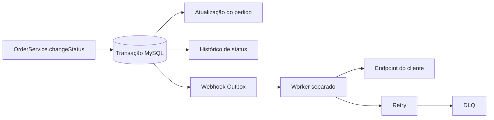

# RFC: Sistema de Webhooks de Notificação de Pedidos

## Metadados

| Campo | Valor |
| --- | --- |
| Autor | William Ferreira Leandro |
| Status | Proposto para revisão |
| Data | 03 de agosto de 2026 |
| Feature | Sistema de Webhooks de Notificação de Pedidos |

## Status

Este RFC está **proposto para revisão** pela equipe técnica (Larissa, Marcos, Bruno, Diego, Sofia). Nenhuma linha de código foi escrita até o momento desta submissão. As decisões arquiteturais aqui resumidas foram fechadas em reunião técnica registrada em `TRANSCRICAO.md` e detalhadas nos seis ADRs listados em "Decisões relacionadas"; este documento não substitui essas decisões, apenas as consolida em nível de proposta técnica para aprovação formal antes do início da implementação (ver `docs/FDD.md` para o detalhamento de implementação).

## TL;DR

Propomos um sistema de webhooks **outbound** para notificar clientes B2B sobre mudanças de status de pedidos, eliminando a necessidade de polling em `GET /orders`. A solução usa um padrão **Outbox transacional** em uma tabela MySQL (mesmo banco já usado pelo OMS), inserida na mesma transação Prisma de `OrderService.changeStatus`. Um **worker Node.js separado**, em processo próprio, consome a outbox via **polling a cada 2 segundos** e entrega os eventos por **HTTP outbound**, assinados com **HMAC-SHA256** (secret por endpoint, rotação com grace period). A entrega é **at-least-once**, com deduplicação do lado do cliente via `X-Event-Id`; falhas passam por **retry com backoff exponencial** (5 tentativas) e, ao esgotar, o evento vai para uma **Dead Letter Queue (DLQ)** reprocessável manualmente. Toda a implementação **reaproveita os padrões já existentes do OMS** (estrutura de módulos, `AppError`, logger Pino, middleware de erro, autenticação JWT/RBAC), sem introduzir infraestrutura nova.

## Contexto e problema

*(Fato — transcrição)* Três clientes B2B — Atlas Comercial, MaxDistribuição e Nova Cargo — enviaram um pedido formal para serem notificados quando o status de seus pedidos muda na plataforma (`[09:00] Marcos`). Hoje esses clientes fazem polling repetido em `GET /orders`, o que Marcos descreve como uma integração "lenta e cara" para eles (`[09:00] Marcos`). Para os clientes, qualquer latência de notificação abaixo de 10 segundos já é considerada "tempo real" (`[09:02] Marcos`).

*(Fato — transcrição)* Existe risco de negócio concreto: a Atlas sinalizou que pode migrar para um concorrente caso a feature não seja entregue até o fim do trimestre, prazo depois refinado para fim de novembro (`[09:00]`, `[09:45] Marcos`).

*(Observação — código)* O OMS atual não possui nenhum mecanismo de eventos, fila ou notificação externa. Uma busca no repositório por arquivos `webhook*`/`worker*` não retornou nenhum resultado (`reports/context-analysis.md`, seção R). A mudança de status de pedido hoje ocorre inteiramente dentro de `OrderService.changeStatus` (`src/modules/orders/order.service.ts:126-179`), que já executa, em uma única transação Prisma, a atualização do pedido, a inserção do histórico e o ajuste de estoque — sem qualquer chamada externa.

## Objetivos

- Notificar os clientes B2B sobre mudanças de status de pedidos sem exigir polling manual (`[09:00]-[09:02] Marcos`).
- Evitar chamadas HTTP síncronas dentro da transação de mudança de status, para não travar outras mudanças de pedido caso o cliente do webhook esteja lento ou indisponível (`[09:04] Bruno`).
- Garantir registro atômico do evento de webhook junto com a mudança de status, eliminando o risco de evento perdido ou órfão (`[09:06]-[09:08]`, `[09:40]-[09:41]`).
- Atender à expectativa de latência do cliente, abaixo de 10 segundos (`[09:02]`, `[09:09]-[09:10]`).
- Proteger a autenticidade e a integridade do payload entregue a terceiros (`[09:19]-[09:20] Sofia`).
- Tolerar indisponibilidade temporária do endpoint do cliente sem descartar o evento prematuramente (`[09:14]-[09:17]`).
- Manter compatibilidade com os padrões arquiteturais já existentes no OMS — módulos, erros, logger, autenticação (`[09:27]-[09:30]`).

## Não objetivos

- **Webhooks inbound** (recepção de eventos vindos de clientes) — DESCARTADO. O modelo é exclusivamente outbound; os clientes só recebem, não enviam (`[09:02]-[09:03] Marcos, Sofia`).
- **Notificação por e-mail** em caso de falhas repetidas de entrega — ADIADO para fase futura, após medição de impacto (`[09:37]-[09:38] Marcos, Larissa`).
- **Dashboard visual** para o cliente acompanhar seus webhooks — DESCARTADO nesta fase; é projeto separado do time de frontend (`[09:39]-[09:40] Marcos, Larissa`).
- **Infraestrutura externa de mensageria** (ex.: Redis Streams) — DESCARTADO; considerado overengineering para o tamanho atual do time (`[09:07] Larissa, Diego`).
- **Escalonamento para múltiplos workers em paralelo** — ADIADO; tratado como "problema do futuro", sem solução avaliada nesta fase (`[09:13] Diego`).
- **Arquivamento/limpeza definitiva da outbox** (linhas já entregues) após ~30 dias — FORA DE ESCOPO explícito desta feature (`[09:08] Diego`).
- **Garantia de entrega exactly-once** — DESCARTADO em favor de at-least-once com deduplicação pelo cliente (`[09:24]-[09:26] Diego`).

## Proposta técnica

### Visão geral

Em alto nível, o fluxo funciona assim:

1. `OrderService.changeStatus` conclui a mudança de status dentro de uma transação Prisma já existente.
2. Na mesma transação, um evento é registrado na outbox (somente se algum webhook do cliente estiver inscrito naquele status de destino).
3. Um worker Node.js separado consulta periodicamente os eventos pendentes na outbox.
4. O worker envia o evento via HTTP `POST` para a URL cadastrada do cliente.
5. Em caso de sucesso, o evento é marcado como entregue.
6. Em caso de falha (erro ou timeout), o evento é reagendado com backoff exponencial.
7. Após esgotar as tentativas, o evento é movido para uma Dead Letter Queue (DLQ).
8. O reprocessamento de eventos em DLQ ocorre manualmente, via endpoint administrativo restrito a `ADMIN`.

Este RFC não detalha schemas, contratos HTTP completos ou o algoritmo interno do worker — esse nível de detalhe pertence ao `docs/FDD.md`.

### Fluxo arquitetural

### Segurança

- Cada requisição de webhook é assinada com **HMAC-SHA256** sobre o corpo, enviada no header `X-Signature`; o cliente verifica a assinatura do lado dele (`[09:19]-[09:20] Sofia`).
- Cada **endpoint de webhook cadastrado tem uma secret exclusiva** — não há secret global da plataforma, reduzindo o impacto de um vazamento (`[09:21] Sofia`).
- A secret é **rotacionável via API**, com a secret antiga válida em paralelo por **24 horas (grace period)** para permitir migração do cliente sem downtime (`[09:21]-[09:22] Sofia`).
- **HTTPS é obrigatório** para a URL do webhook; cadastro com `http` é recusado na validação (tratado como requisito não funcional, não como decisão arquitetural própria — `[09:23] Sofia, Larissa`).
- Headers definidos para o envio: `X-Event-Id`, `X-Signature`, `X-Timestamp`, `X-Webhook-Id`, `Content-Type: application/json` (`[09:44]-[09:45] Diego, Sofia`).
- O endpoint administrativo de replay de DLQ exige role `ADMIN` (via `requireRole` já existente) e deve logar quem executou a ação, para auditoria (`[09:35]-[09:36] Sofia, Larissa`).

Detalhes de implementação criptográfica (geração/armazenamento de secret, verificação de assinatura) não são especificados aqui — ver ADR-004 e `docs/FDD.md`.

### Garantia de entrega e resiliência

- A entrega é **at-least-once**, não exactly-once: o cliente pode receber o mesmo evento mais de uma vez e deve deduplicar localmente usando o `X-Event-Id`, um UUID único gerado na inserção do evento (`[09:24]-[09:26] Diego`).
- Falhas de entrega (erro ou timeout) entram em **retry com backoff exponencial**: até **5 tentativas**, com progressão de **1 minuto, 5 minutos, 30 minutos, 2 horas e 12 horas** — cobrindo cerca de 15 horas de indisponibilidade do cliente (`[09:14]-[09:17]`).
- O **timeout do HTTP call** do worker é de **10 segundos**; um cliente que não responde nesse prazo é tratado como falha e entra no fluxo de retry (`[09:42] Diego, Sofia`).
- Após a 5ª tentativa falhar, o evento é movido para uma **DLQ em tabela separada**, mantendo a outbox principal limpa e servindo como evidência para reprocessamento manual (`[09:17]-[09:19] Diego`).
- **Limitação conhecida de ordenação**: a entrega só é garantida em ordem por `order_id`, e apenas enquanto o sistema operar em regime de **um único worker**. Não há garantia de ordenação global; essa garantia se perde caso o sistema escale para múltiplos workers no futuro (`[09:12]-[09:13] Diego, Larissa`). Os clientes não solicitaram ordenação global, apenas saber quando cada pedido individual mudou (`[09:14] Marcos`).

### Integração com o OMS existente

A feature se integra a pontos reais e já existentes do código, sem exigir alteração estrutural:

- `src/modules/orders/order.service.ts` — método `changeStatus` (linhas 126-179) é o ponto onde o evento passa a ser registrado na outbox, dentro da transação já existente.
- `prisma/schema.prisma` — schema atual fornece os campos usados no payload do evento (`Order`, `OrderStatusHistory`, `OrderStatus`); novos modelos para outbox, DLQ e configuração de webhook são propostos, ainda não existem.
- `src/app.ts` e `src/routes/index.ts` — pontos onde um novo módulo de webhooks seria registrado, seguindo a composição manual de dependências já usada pelos demais módulos.
- `src/shared/errors/app-error.ts` e `src/middlewares/error.middleware.ts` — padrão `AppError` e tratamento de erro central já existentes, reaproveitados sem alteração para os novos erros do domínio.
- `src/shared/logger/index.ts` — logger Pino singleton, reaproveitado tanto pela API quanto pelo futuro worker.
- `src/server.ts` — referência de padrão de entry point (bootstrap, shutdown gracioso) para o futuro `src/worker.ts`.

**Importante**: `src/worker.ts` e `src/modules/webhooks/` são **elementos futuros propostos**, ainda não existentes no repositório. Nenhum artefato de webhook foi encontrado em buscas no código-fonte até o momento desta proposta.

## Alternativas consideradas

### Envio HTTP síncrono dentro de `changeStatus`

Disparar o webhook diretamente na transação de mudança de status foi a primeira opção discutida e rejeitada. Um cliente de webhook lento ou fora do ar bloquearia a transação, impedindo mudanças de status de outros pedidos; além disso, não haveria forma limpa de decidir sobre rollback caso a chamada externa falhasse — uma falha de terceiro não deve reverter uma mudança de status legítima (`[09:03]-[09:05] Bruno, Larissa`). Rejeitada em favor do padrão Outbox assíncrono (ADR-001).

### Redis Streams ou mensageria externa dedicada

Considerada como alternativa ao Outbox em MySQL. Rejeitada por exigir subir e operar infraestrutura nova (ex.: Redis Cluster), avaliada como overengineering para o tamanho atual do time; o MySQL já existente resolve o problema sem essa infraestrutura adicional (`[09:07] Larissa, Diego`).

### Outras alternativas discutidas e descartadas

- **Trigger de banco de dados** para notificar o worker de forma reativa: descartada porque o MySQL não tem um mecanismo nativo equivalente ao `NOTIFY/LISTEN`; um trigger só executa SQL e não notifica processos externos de forma limpa (`[09:09] Bruno, Diego`).
- **Retry indefinido** (sem teto de tentativas): descartado por deixar eventos "pendurados para sempre" caso o cliente desapareça definitivamente (`[09:15] Diego`).
- **3 tentativas de retry**: descartada por ser insuficiente frente a uma indisponibilidade real já observada (cliente com 2h de manutenção planejada) (`[09:16] Bruno, Diego`).
- **Garantia exactly-once**: descartada por exigir coordenação complexa entre as duas partes; at-least-once com `X-Event-Id` é o padrão de mercado citado (Stripe, GitHub) e resolve "99% dos casos" (`[09:24]-[09:26] Diego`).
- **Status "failed" na própria tabela de outbox** (em vez de DLQ separada): descartada para manter a outbox principal limpa para leitura do worker e isolar evidências de falha (`[09:17]-[09:18] Diego`).

## Questões em aberto

- **Rate limiting de envio ao cliente**: se um cliente tiver muitos pedidos mudando de status em pouco tempo, o sistema pode enviar um volume alto de chamadas em rajada. Não há mitigação decidida; a equipe optou por observar e decidir depois (`[09:38]-[09:39] Diego, Larissa`).
- **Contrato exato do endpoint de rotação de secret**: o comportamento (nova secret, grace period de 24h) foi decidido, mas método HTTP e path não foram especificados na reunião (`[09:21]-[09:22] Sofia`).
- **Endurecimento futuro de RBAC no CRUD de configuração de webhook**: hoje qualquer role autenticada tem acesso; Sofia sinalizou que isso pode ser revisado mais à frente, sem compromisso de quando (`[09:36]-[09:37] Sofia, Marcos`).
- **Nome do arquivo de processamento do worker**: Bruno propôs `webhook.worker.ts` ou `webhook.processor.ts`; Diego apenas concordou com a ideia geral, sem escolher entre as duas opções (`[09:28] Bruno`).
- **Estratégia de arquivamento da outbox**: Diego mencionou arquivar linhas já entregues após ~30 dias, mas isso foi classificado como explicitamente fora do escopo desta feature, sem mecanismo definido (`[09:08] Diego`).
- **Escalonamento para múltiplos workers**: soluções possíveis (particionamento por `order_id`, lock pessimista) foram citadas, mas nenhuma foi avaliada ou decidida (`[09:13] Diego`).

## Impactos e riscos

| Risco | Mitigação |
| --- | --- |
| Crescimento contínuo da tabela de outbox degradando a performance de leitura do worker | Índices em `status`/`created_at`, leitura em lote pequeno dos pendentes (`[09:07]-[09:08]`); arquivamento fica como questão em aberto |
| Indisponibilidade prolongada do endpoint do cliente causando perda de eventos | 5 tentativas com backoff estendido até ~15h antes de ir para DLQ (`[09:15]-[09:17]`) |
| Duplicidade de eventos recebidos pelo cliente (inerente ao at-least-once) | Deduplicação client-side via `X-Event-Id`; documentação explícita no portal do desenvolvedor (`[09:24]-[09:26]`) |
| Vazamento de secret comprometendo a integração de um cliente | Secret exclusiva por endpoint (não global) e suporte a rotação com grace period de 24h (`[09:21]-[09:22]`) |
| Worker único como limitação de throughput/ordenação | Aceito nesta fase; clientes não pediram ordenação global; escalonamento fica como questão em aberto (`[09:12]-[09:14]`) |
| Falha na inserção do evento na outbox provoca rollback de toda a transação de `changeStatus` (inclusive ajustes de estoque) | Acoplamento deliberado: garante que não exista caso de status mudar sem o evento ser registrado, ou vice-versa (`[09:40]-[09:41]`) |
| Dependência operacional de um novo processo (worker) rodando em paralelo à API | Worker como processo Node separado, evitando que reinícios da API derrubem as entregas pendentes (`[09:11]`) |

Nenhuma probabilidade numérica é atribuída a esses riscos — a reunião não quantificou probabilidade para nenhum deles (`reports/context-analysis.md`, seção K).

## Estratégia de implantação

A entrega foi estimada por Larissa em **três sprints**, incluindo a revisão de segurança da Sofia (`[09:45]-[09:47] Larissa`):

1. Modelagem da outbox e da DLQ — cerca de 1 sprint.
2. Implementação do worker e da lógica de retry — cerca de 1 sprint.
3. CRUD de configuração de webhook e histórico de entregas — cerca de 0,5 sprint.
4. Integração em `OrderService.changeStatus` e testes ponta a ponta — cerca de 0,5 sprint.
5. HMAC, schemas de validação e demais ajustes — tempo restante da estimativa.
6. **Revisão de segurança**: Sofia reserva pelo menos **2 dias úteis** para revisar especificamente o código de HMAC e geração de secret antes do deploy (`[09:46] Sofia`).

O prazo de negócio associado (pedido da Atlas) é **fim de novembro** (`[09:45] Marcos`). Este RFC não define um cronograma detalhado por dia ou tarefa — apenas a divisão em blocos discutida na reunião.

## Decisões relacionadas

- [`./adrs/ADR-001-outbox-transacional-no-mysql.md`](./adrs/ADR-001-outbox-transacional-no-mysql.md) — adota o padrão Outbox transacional no MySQL como mecanismo de publicação de eventos, em vez de disparo síncrono ou fila externa.
- [`./adrs/ADR-002-worker-separado-com-polling.md`](./adrs/ADR-002-worker-separado-com-polling.md) — define o worker como processo Node separado, consumindo a outbox via polling a cada 2 segundos, e registra a limitação de ordenação condicionada a single-worker.
- [`./adrs/ADR-003-retry-com-backoff-e-dlq.md`](./adrs/ADR-003-retry-com-backoff-e-dlq.md) — define a política de retry com backoff exponencial (5 tentativas) e a DLQ com replay manual restrito a `ADMIN`.
- [`./adrs/ADR-004-autenticacao-hmac-sha256.md`](./adrs/ADR-004-autenticacao-hmac-sha256.md) — define a assinatura HMAC-SHA256 do payload, secret por endpoint e rotação com grace period de 24h.
- [`./adrs/ADR-005-entrega-at-least-once-com-event-id.md`](./adrs/ADR-005-entrega-at-least-once-com-event-id.md) — define a garantia de entrega at-least-once com deduplicação via `X-Event-Id` e o formato básico do payload/headers.
- [`./adrs/ADR-006-reuso-dos-padroes-existentes.md`](./adrs/ADR-006-reuso-dos-padroes-existentes.md) — define que o módulo de webhooks reaproveita integralmente os padrões arquiteturais já existentes no OMS, sem infraestrutura nova.

## Revisores

- **Larissa** — Tech Lead
- **Marcos** — Product Manager
- **Bruno** — Engenheiro Pleno, time de Pedidos
- **Diego** — Engenheiro Sênior, time de Plataforma
- **Sofia** — Engenheira de Segurança

## Rastreabilidade

| Item | Fonte | Localização |
| --- | --- | --- |
| Problema de negócio (clientes B2B pedindo notificação em tempo real) | TRANSCRICAO | `[09:00] Marcos` |
| Latência inferior a 10 segundos | TRANSCRICAO | `[09:02] Marcos` |
| Padrão Outbox transacional no MySQL | TRANSCRICAO / ADR-001 | `[09:03]-[09:08]` |
| Worker separado com polling de 2s | TRANSCRICAO / ADR-002 | `[09:09]-[09:11]` |
| Retry com backoff exponencial | TRANSCRICAO / ADR-003 | `[09:14]-[09:17]` |
| DLQ e replay administrativo | TRANSCRICAO / ADR-003 | `[09:17]-[09:19]`, `[09:35]-[09:36]` |
| HMAC-SHA256 e secret por endpoint | TRANSCRICAO / ADR-004 | `[09:19]-[09:22]` |
| Entrega at-least-once com `X-Event-Id` | TRANSCRICAO / ADR-005 | `[09:24]-[09:26]` |
| Reuso dos padrões existentes do OMS | TRANSCRICAO / ADR-006 | `[09:27]-[09:37]` |
| Questões em aberto (rate limiting, rotação de secret, RBAC, nome do worker) | TRANSCRICAO | `[09:21]-[09:22]`, `[09:28]`, `[09:36]-[09:39]` |
| Principais caminhos de código existentes | CODIGO | `src/modules/orders/order.service.ts`, `prisma/schema.prisma`, `src/app.ts`, `src/routes/index.ts`, `src/shared/errors/app-error.ts`, `src/middlewares/error.middleware.ts`, `src/shared/logger/index.ts`, `src/server.ts` |

A cobertura detalhada de rastreabilidade (decisão a decisão, requisito a requisito) está mantida em `docs/TRACKER.md`.
